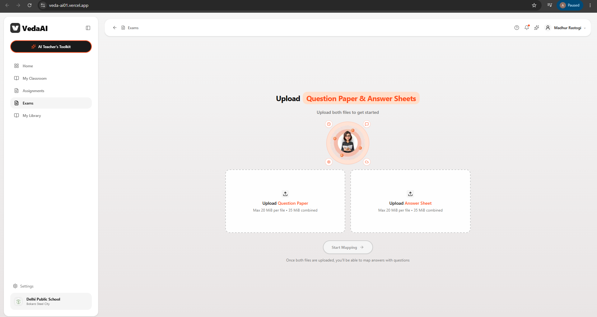
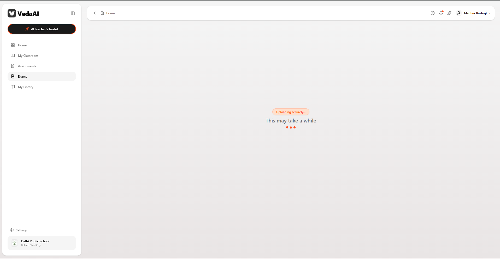
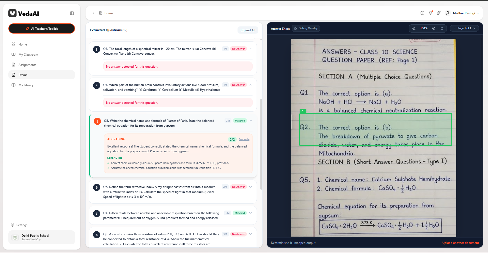

# 🤖 VedaAI

### AI-powered exam evaluation and answer-sheet analysis platform.

VedaAI is an AI-powered education platform designed to help teachers evaluate student answer sheets by combining question-paper analysis, answer-sheet mapping, automated grading, and visual document inspection.

The platform allows teachers to upload a **question paper** and a corresponding **answer sheet**, automatically process the documents, map answers to questions, and review AI-generated grading results through an interactive interface.

---

## 🌐 Live Demo

🚀 **[Visit VedaAI](https://veda-ai01.vercel.app/)**

---

## 📸 Screenshots

### 📝 Exam Document Upload

Teachers can upload both the question paper and answer sheet to begin the evaluation workflow.



---

### 🧠 Question & Answer Mapping

After processing the documents, VedaAI extracts questions and maps them against the corresponding answers.

The interface allows teachers to inspect the extracted questions alongside the uploaded answer sheet.



---

### 📊 AI Grading & Evaluation

VedaAI provides an interactive evaluation interface where mapped answers can be reviewed along with AI-generated grading, scores, strengths, and feedback.



---

## 💡 What is VedaAI?

Evaluating large numbers of handwritten or uploaded answer sheets can require significant manual effort.

VedaAI explores how AI can assist teachers by creating a workflow that connects:

```text
Question Paper
      ↓
Answer Sheet
      ↓
Document Processing
      ↓
Question Extraction
      ↓
Answer Mapping
      ↓
AI Evaluation
      ↓
Score & Feedback
